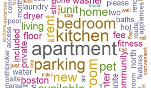
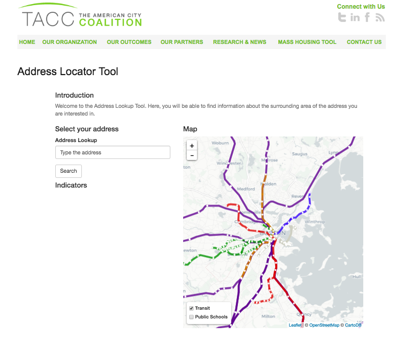
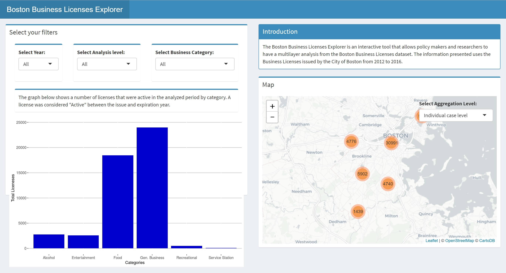

Combining my background in economics and my graduate studies in Urban Informatics, I use public data to better understand cities and propose public policies that aim to improve them. My most recent projects have been related to public housing and business environment.

The data that I use can be either publicly available through city release or through web scraping and the tools are R (R, RStudio Shinyapps) and GIS (QGIS, ArcGIS, CARTO).
 
 

### **Affordable Housing**:

__Craigslist's Rental Housing Infrastructure: __

Craigslist.org is a large source of information for many different items, but especially, for rental housing. At BARI and TACC, I built an infrastructure to collect, store, and share this information for all rental housing in the state of Massachusetts. This information has the potential to provide a deeper analysis of the rental market and, thus, change or redirect some public policies about affordable housing.

__Tools:__ R
 
__Links:__

* [Documentation for the scraper](documents/TACC Craigslist scraper - Documentation.pdf){target="_blank"}

 
 

__Mass Housing Locator Platform: __

At TACC I developed a free open-source online tool to help reduce some of the barriers low-income families face in using their housing voucher to access rental units in higher opportunity areas. The tool has three components: a "House Locator Tool", that allows renters to explore new areas and expand their search; an "Address Locator Tool" that allows the searchers to look for social and environmental indicators for a particular address; and a "Weekly Listings Alert" that allows the users, by signing up for a newsletter, to receive a tailored list of online housing listings in curated areas. 

__Tools:__ R, R Studio's Shiny apps, GoogleMaps API, Walkscore API and FCC API
 
__Links:__

* [Mass Housing Tool](http://tamcc.org/mass-housing-tool){target="_blank"}.
* [Presentation at BARI's Spring Conference 2018](documents/Mass Housing Tool - Presentation.pdf){target="_blank"}.

 

__Rental Housing Market Analysis: __

Rental Market Analysis are important to understand what the current market looks like and to analyze how current public policies adjust to it. At TACC we developed a few market analysis comparing different public housing payment standard with current prices from the data collected from Craigslist.org

__Tools:__ R, GIS
 
__Links:__

* [DHCD Short version](documents/Cantar, Lautaro - DHCD.pdf){target="_blank"}.

### **Business Licenses**:

__Boston Business Licenses Explorer__

The _"Boston Business Licenses Explorer"_ is an interactive tool that allows the user to analyze the Boston Business Licenses dataset from different perspectives: year, type of business and geographical unit.

I presented this project in the "[Analyze Boston Open Data Challenge](https://data.boston.gov/pages/opendatachallenge){target="_blank"}" and I won **_second prize_** at the "Making Open Data Local" track.

__Tools:__ R and the "Shiny" package.
 
__Links:__

* [Code and more information](https://github.com/lautarocantar/BostonBusinessLicExplorer){target="_blank"}.
* [Link to the App](https://boston-bl.shinyapps.io/App-1/){target="_blank"}.

 
 
 
 

__Analyzing geographical significance of commercial gentrification determinants using open data sources and social media__

In this paper I propose to analyze the geographical effects of the  commercial gentrification determinants using open data. The City of Boston releases on regular basis Business Licenses, Building Permits, and 311 requests data. The main hypothesis is that not all determinants have the same geographical effect on the commercial gentrification in a particular area.
  
[Here](https://github.com/lautarocantar/Portfolio/blob/master/Cantar%2C%20Lautaro%20-%20Geographical%20gentrification.pdf){target="_blank"} you will find the paper.

